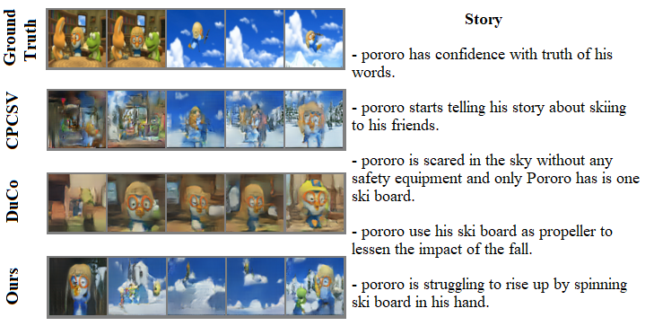

# Modular StoryGAN
Modular StoryGAN with Background and Theme Awareness for Story Visualization. <br>
Paper link: https://link.springer.com/chapter/10.1007/978-3-031-09037-0_23

## Acknowledgement
The code in this repository has been adopted and merged from both  [StoryViz (DuCo)](https://github.com/adymaharana/StoryViz) and [ECCV2020_CPCSV](https://github.com/yunzhusong/ECCV2020_CPCSV).

## Introduction
In story visualization task, given a series of natural language sentences that compose a story, a sequence of images should be generated that correspond to the sentences. <br>
We proposed a new modular model architecture named **Modular StoryGAN** containing the best promising components of [StoryViz (DuCo)](https://github.com/adymaharana/StoryViz) and [ECCV2020_CPCSV](https://github.com/yunzhusong/ECCV2020_CPCSV) to address the local and global consistency challenge which is faced by them. <br>
Additionally, to measure the *local* and *global* consistency we introduced **background & theme awareness**, which are expected attributes of the solutions.
Based on the human evaluation, the generated images demonstrate that Modular StoryGAN possesses background and theme awareness. Besides the subjective evaluation, the objective one also shows that our model outperforms the state-of-the-art [StoryViz (DuCo)](https://github.com/adymaharana/StoryViz) and [ECCV2020_CPCSV](https://github.com/yunzhusong/ECCV2020_CPCSV) models.

## Results
In the paper, we provide qualitative and quantitative evaluation results. The below two examples show our model ability to maintain the consistency through the whole story, while being aware of the background and the theme aspects.
#### Background awareness
<br><br><br>
#### Theme awareness
<br><br><br>

## Usage
Training, inference and evaluation procedure is similar to the one in [StoryViz (DuCo)](https://github.com/adymaharana/StoryViz) and [ECCV2020_CPCSV](https://github.com/yunzhusong/ECCV2020_CPCSV) repositories.
Please refer to this repository and cite our publication when using this work.

## Pretrained model and generated samples
The pretrained model and sample of generated data can be downloaded from [ModularStoryGAN folder](https://bmeedu-my.sharepoint.com/:f:/g/personal/alshouha_edu_bme_hu/EkkRkgqDfHtDjNWwjDnRuXkB3Pi3A_uXX8f05YhgqJyn3A?e=Ri0faC).

## Cite
```
@inproceedings{szHucs2022modular,
  title={Modular StoryGAN with Background and Theme Awareness for Story Visualization},
  author={Sz{\H{u}}cs, G{\'a}bor and Al-Shouha, Modafar},
  booktitle={International Conference on Pattern Recognition and Artificial Intelligence},
  pages={275--286},
  year={2022},
  organization={Springer},
  doi={10.1007/978-3-031-09037-0_23}
}
```

## License
Other work and this work licences are included in <a href="./Licenses/">Licenses</a> folder. <br>
This work license is: <a href="./Licenses/LICENSE">GNU Affero General Public License v3.0</a>.

## Note
This code is ready to be used, however, its development is *in-progress* state.
